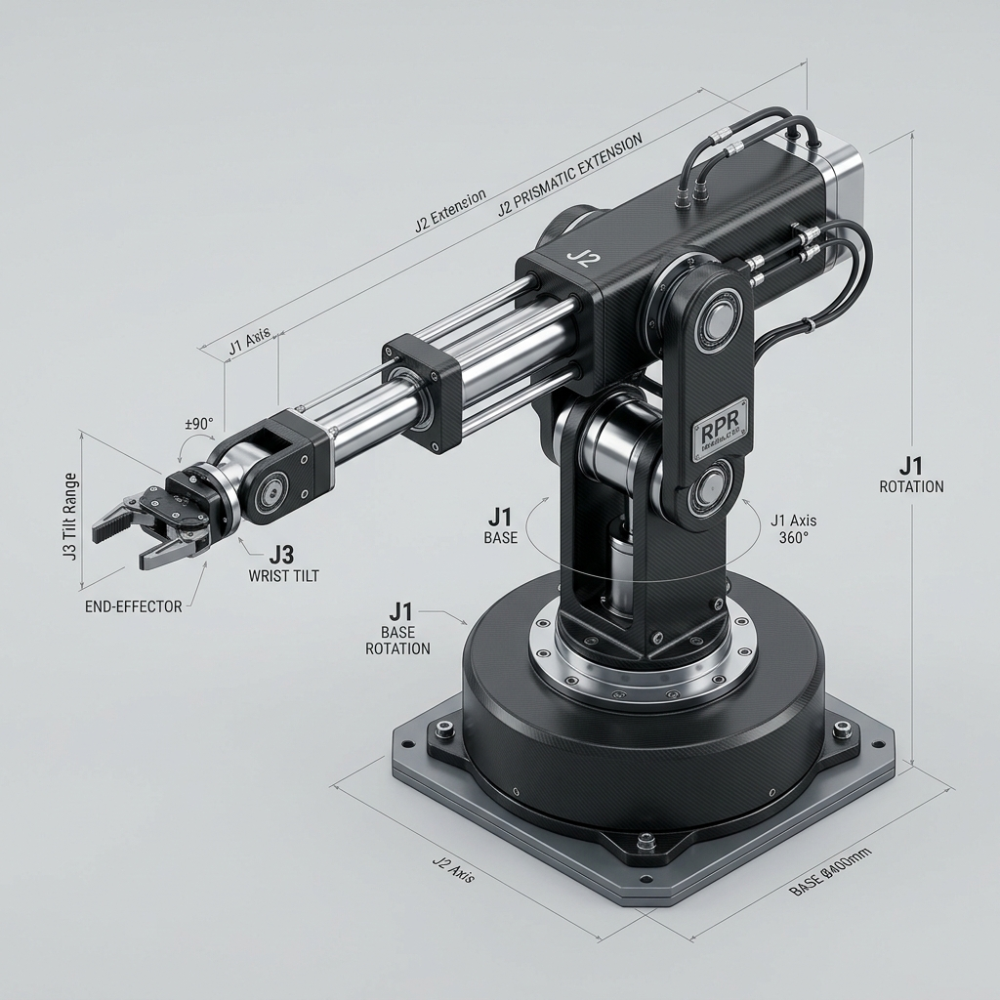
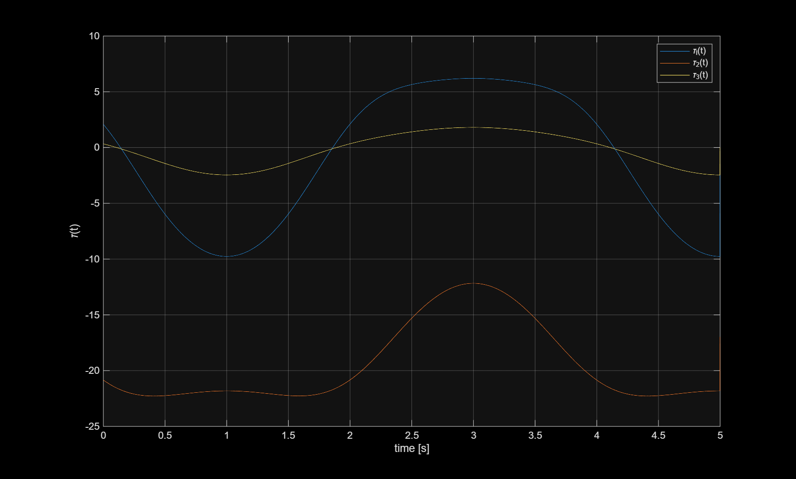

# Spatial RPR Robot Manipulator: Kinematics, Symbolic Dynamics & Simulation

  

This repository showcases the kinematics modeling, symbolic dynamics derivation, and numerical simulation of a **3-DOF Spatial RPR (Revolute-Prismatic-Revolute)** robot manipulator. The model is implemented in MATLAB using symbolic calculations and numerical simulations.

## Project Structure

* **`DH.m`**: A helper function to compute the Denavit-Hartenberg transformation matrix for a joint, including numeric thresholding to clean up floating-point residuals (e.g., values $< 10^{-10}$ are set to zero).
* **`RPR_dynamic_model.mlx`**: A MATLAB Live Script that symbolically derives the robot's inverse dynamic model using the **Moving Frames Algorithm** and the **Euler-Lagrange** formulation.
* **`RPR_dynamic_model_simulation.m`**: A MATLAB simulation script that applies physical parameters, generates sinusoidal joint trajectories, evaluates the symbolic inverse dynamics equations, and plots the resulting joint torques/forces over time.
* **`simulation_plot.png`**: The generated plot showing the generalized joint forces/torques required to track the trajectories.

---

## Kinematics & DH Parameters

The spatial RPR robot consists of three joints:
1. **Joint 1 (Revolute)**: Rotates about the vertical axis ($z_0$).
2. **Joint 2 (Prismatic)**: Translates along its axis.
3. **Joint 3 (Revolute)**: Rotates about the axis perpendicular to Joint 2.

The Denavit-Hartenberg (DH) parameters used to define the kinematics are:

| Link | Joint Type | $a_i$ | $\alpha_i$ | $d_i$ | $\theta_i$ |
| :---: | :---: | :---: | :---: | :---: | :---: |
| **1** | Revolute (R) | $0$ | $\pi/2$ | $0$ | $q_1$ |
| **2** | Prismatic (P) | $0$ | $0$ | $0$ | $q_2$ |
| **3** | Revolute (R) | $0$ | $0$ | $q_3$ | $0$ |

---

## Velocity Analysis (Moving Frames Algorithm)

To calculate the kinetic energy of each link, the linear and angular velocities of the centers of mass (CoM) are calculated recursively from the base (Link 0) to the end-effector (Link 3) using the **Moving Frames Algorithm**:

### Angular Velocities
$$\omega_i = R_i^T \left( \omega_{i-1} + (1 - \sigma_i) \dot{q}_i z_0 \right)$$

### Linear Velocities
$$v_i = R_i^T \left( v_{i-1} + \sigma_i \dot{q}_i z_0 + \omega_{i-1} \times r_{i-1, i} \right)$$
$$v_{ci} = v_i + \omega_i \times r_{c,i}$$

*where $\sigma_i = 0$ for revolute joints, $\sigma_i = 1$ for prismatic joints, and $r_{c,i}$ is the position of the center of mass of link $i$ relative to frame $i$.*

---

## Symbolic Dynamic Modeling

Using Koenig's theorem, the total kinetic energy ($T$) and potential energy ($U$) of the manipulator are computed:

$$T = \sum_{i=1}^3 \left( \frac{1}{2} m_i v_{ci}^T v_{ci} + \frac{1}{2} \omega_i^T I_i \omega_i \right)$$

$$U = \sum_{i=1}^3 m_i g_0^T r_{ci}$$

From the Lagrangian $\mathcal{L} = T - U$, the equations of motion are derived in the standard joint-space formulation:

$$\tau = M(q)\ddot{q} + c(q, \dot{q}) + g(q)$$

* **$M(q)$**: Symmetric $3 \times 3$ Mass Matrix.
* **$c(q, \dot{q})$**: Coriolis and Centrifugal force vector, computed using Christoffel symbols of the first kind:
  $$c_i = \dot{q}^T C_i \dot{q}$$
* **$g(q)$**: Gravity torque/force vector.

---

## Trajectory Simulation & Torques

The joint controllers are simulated tracking a synchronized sinusoidal trajectory over 5 seconds:
$$q_1(t) = q_2(t) = q_3(t) = \frac{\pi}{6} \sin\left(\frac{\pi}{2} t\right)$$

The resulting joint forces/torques $\tau_i(t)$ calculated by the **Inverse Dynamic Model** are plotted below:

---

## How to Run the Simulation

1. Open MATLAB and navigate to the project directory.
2. Open and run the Live Script **`RPR_dynamic_model.mlx`** to define the symbolic variables and derive the symbolic equations of motion (`tau`).
3. Run the MATLAB script **`RPR_dynamic_model_simulation.m`** to simulate the trajectory tracking and view/generate the torque plot.
